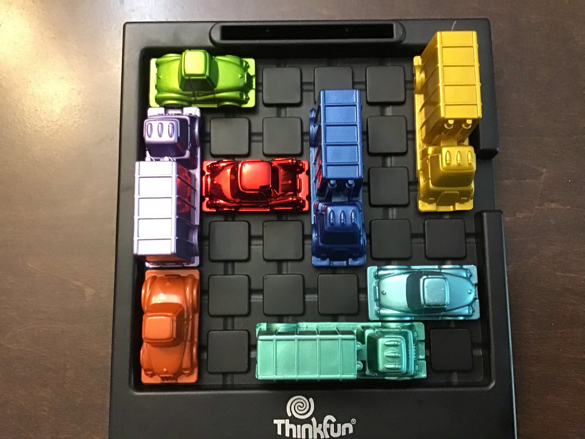

# Rush Hour Solver

Rush Hour is a game where the objective is to free a red car from the board. You can move any car on the board but only into an empty space that is available. There is a hole just big enough for the red car to escape through. No other cars are allowed to escape.

## Motivation

The reason for creating this solver is because it is a good intermediary step between different kinds of solvers that I want to make. The most recent solver that I worked on was for a game called Queens but I would eventually like to make optimizers for situations that involve time-steps of seconds or milliseconds rather than turns. This game does involve steps, only one car can be moved at a time, and a solution could be optimized with the objective of completing a game using the fewest number of steps.

## Challenges

One challenge will be trying to dynamically change where the exit on the board is. What kind of coordinate system should be used to denote the lines of a grid rather than the cells?

How will objects on the grid be represented? They have a length and width.

I don't have an internet connection right now so I don't remember if in the game are cars allowed to move sideways or if they can only move in the axis that they are longest.

How can the solver optimize for the least number of turns? One solution I can think of is for each step to be given an increasing penalty. The solver can expect that a game will take no more than 100 or 1000 steps and that each step that occurs while the game is already solved will add 0 to the score. Steps that happen before the game is solved add their penalty to the score. The goal is to minimize the penalty.
